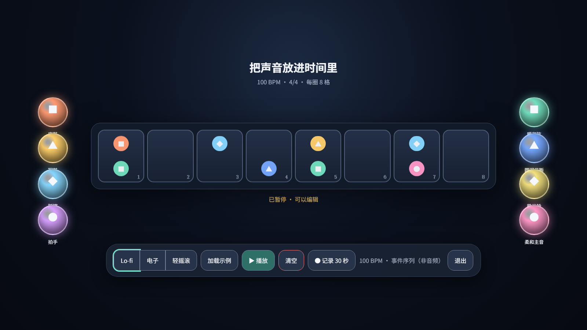
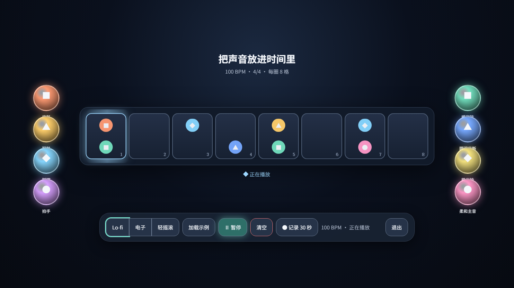

# PalmEnsemble｜掌上空间乐团

PalmEnsemble 是一款基于 **PICO Spatial SDK Stage** 的中文空间八拍循环乐器，包名为 `com.pico.swan.palmensemble`。

它面向没有乐理基础的用户：从左右两侧抓取声音球，放进中央 8 格节拍轨道，播放后扫描光会逐格触发声音。项目固定为 100 BPM，不提供复杂 DAW、歌曲导入、版权曲库或联网分享。

## 界面预览

| 轨道编辑态 | 播放扫描态 |
| --- | --- |
|  |  |

> 上图为与实现状态对应的设计验收图。PICO 模拟器的空间合成层在部分环境中无法通过普通 ADB 截图完整捕获，因此不将黑块截图冒充设备实拍。

## 核心功能

- 中央 8 格循环轨道，左侧 4 个鼓点音色，右侧 4 个和弦/旋律音色。
- 每颗声音球都有颜色、图标、中文名称和点选试听反馈。
- 支持拖动放入、格子吸附、替换，以及把轨道内声音球拖出后丢弃。
- 固定 100 BPM、4/4 拍，每格 300 ms，每个 8-step 小节 2.4 秒。
- Lo-fi、电子、轻摇滚三套明显不同的本地合成音色。
- 一键示例、随机生成、全自动循环、播放/暂停、清空和 30 秒事件记录。
- 播放中的修改只在下一小节边界生效，避免突然断拍。
- 音频和事件数据均在本地处理，不依赖网络或版权曲库。

## 一分钟上手

1. 面向舒服的正前方打开应用；界面完成一次性定位后会保持固定，不随视线移动。
2. 点击“开始演示”或“示例”，立即听到一组完整节奏。
3. 按住左侧鼓点球或右侧旋律球，拖向中央轨道。
4. 当目标格高亮时松手，声音球会吸附到该格。
5. 按住轨道里的声音球向外拖，出现“松手丢弃”提示后释放即可移除。
6. 点击播放，在扫描光经过各格时听到对应声音。

也可以先点击声音球进行试听和选择，再点击格子顶部的数字完成放置。

## 节拍与量化规则

PalmEnsemble 使用双 Pattern 模型：

- `active Pattern`：当前正在播放的 8 格内容。
- `pending Pattern`：播放中产生、等待下一小节生效的修改。

暂停时，放置、替换、移除、随机生成和清空会立即生效。播放时，这些修改先进入 `pending Pattern`，在扫描从第 8 格回到第 1 格（`7→0`）时一次性提交。

因此：

- 当前小节不会被中途切断。
- 同一小节内的多次编辑会合并到下一组内容。
- 8 格循环能够连续衔接。

## 三种音乐风格

| 风格 | 听感方向 | 行为 |
| --- | --- | --- |
| Lo-fi | 暗暖、削频、轻微磁带抖动 | 替换八种音色，不修改轨道内容 |
| 电子 | 明亮、短促、锯齿/方波/FM 质感 | 替换八种音色，不修改轨道内容 |
| 轻摇滚 | 厚实、驱动、和弦与噪声鼓组 | 替换八种音色，不修改轨道内容 |

暂停时风格立即切换；播放时风格在下一个 `7→0` 小节边界生效。只有用户明确点击“示例”时，应用才会加载与当前风格对应的示例编排。

## 随机与全自动

- **随机生成**：重新生成一条 8 格轨道，允许出现空格；不会改变当前音乐风格。
- **全自动**：每个小节结束时生成下一组随机轨道，并持续循环；始终保持用户当前选择的风格。
- **暂停/继续**：暂停不会关闭全自动模式，继续播放后仍按小节自动生成。
- **关闭全自动**：保留当前一组轨道，不清空已有内容。

## 手柄操作

- 手柄射线：选择按钮、声音球和格子。
- 扳机按住并移动：拖动声音球。
- 右手 A：播放/暂停。
- 右手 B：取消当前声音选择。

当前版本不提供运行中校准。应用启动约 650 ms 后，以当时的相机朝向创建一次 `TrackingMode.ONCE` 锚点，之后保持世界锁定。

## 30 秒记录说明

“记录 30 秒”保存的是带相对时间戳的本地 JSON 事件序列，包括播放、放置、移除、风格和自动模式等操作。

它是录制骨架，**不是音频录音文件**。项目尚未接入 PICO 系统混音或录屏 API，界面中对此有明确标注。

## 技术栈

- Kotlin 2.1.20
- Android Gradle Plugin 8.13.2
- PICO Spatial SDK BOM 0.13.3
- SpatialUI Compose + PicoTheme
- Android API 35
- `arm64-v8a`
- JUnit 4

## 开发环境

建议准备：

- JDK 17
- Android SDK Platform 35
- PICO Spatial SDK/开发环境
- 可选：`pico-cli`，用于设备检查、APK 安装和启动

本地 `local.properties`、密钥文件、APK 和 IDE 配置均已由 `.gitignore` 排除。

## 构建与测试

在项目根目录执行：

```powershell
.\gradlew.bat testDebugUnitTest assembleDebug
```

生成的 Debug APK：

```text
app/build/outputs/apk/debug/app-debug.apk
```

只构建 APK：

```powershell
.\gradlew.bat assembleDebug
```

## 安装到 PICO 设备

先查看在线设备：

```powershell
pico-cli device list --format json
```

安装并启动：

```powershell
pico-cli app install app/build/outputs/apk/debug/app-debug.apk --replace --device <设备ID>
pico-cli app launch com.pico.swan.palmensemble --activity .platform.LaunchActivity --device <设备ID>
```

如果同时运行了其他 Full Space Stage 应用，需要先退出或停止竞争应用；PICO 同一时间只能显示一个前台 Stage。

## 项目结构

```text
PalmEnsemble/
├─ app/src/main/java/com/pico/swan/palmensemble/
│  ├─ content/              # Stage、空间面板、拖放和定位
│  ├─ domain/model/         # Pattern、Step、Sound、Atmosphere
│  ├─ domain/usecase/       # 量化音序器、风格与自动生成
│  ├─ platform/             # Spatial 启动、合成音频引擎
│  ├─ data/repository/      # 本地事件序列保存
│  └─ ui/ensemble/          # UI 状态与 ViewModel
├─ app/src/test/            # 音序、量化、随机、拖放、音色测试
├─ artifacts/               # 截图与设备/模拟器验证记录
├─ design/                  # 交互、视觉与 QA 设计交付
└─ MVP_ACCEPTANCE.md        # MVP 验收边界
```

## 主要实现文件

- `HomeStage.kt`：Stage 布局、声音球、8 格轨道、拖放、丢弃、控制区和教程。
- `QuantizedSequencer.kt`：100 BPM 播放时钟与 `active/pending` 小节提交。
- `PalmEnsembleViewModel.kt`：用户事件、播放、风格、随机、全自动和记录状态。
- `SynthAudioEngine.kt` / `SynthToneGenerator.kt`：八种本地合成音色及三套风格渲染。
- `EventSequenceRepository.kt`：30 秒事件序列 JSON 保存。

## 自动验证覆盖

单元测试覆盖：

- 暂停时立即编辑。
- 播放中下一小节量化提交。
- 多次 pending 修改合并。
- 风格切换保持用户轨道不变。
- 三套风格 PCM 差异。
- 随机轨道长度、空格与音色 family 合法性。
- 左右声音球拖入吸附与轨道拖出丢弃阈值。
- 弹窗、轨道和拖动浮层深度顺序。

更多验证记录见 [`MVP_ACCEPTANCE.md`](MVP_ACCEPTANCE.md) 和 [`artifacts/device-test-20260814.md`](artifacts/device-test-20260814.md)。

## 明确不做

- 导入歌曲或版权音乐曲库
- 自动作曲或生成式音乐服务
- 专业 DAW、多轨编曲与复杂混音
- 联网分享、社区或账号系统
- 运行中视线跟随或动态校准

## 当前限制

- 30 秒记录保存事件序列，不生成音频文件。
- 空间手柄拖动、实际音频延迟、舒适距离和长时间疲劳需要以真实 PICO 设备人工验收为准。
- 模拟器普通截图可能无法完整捕获空间合成层。
